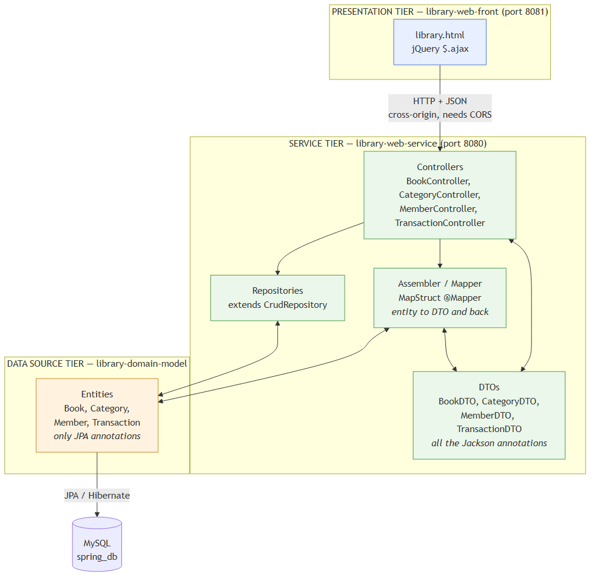

# Day 4 sample: three tiers, DTOs and integration tests

This is the worked example for the **Software Design** lecture and for the lab
[lab-web-3tier](https://github.com/camtdii/lab-web-3tier).

The same library application you already know, taken apart into three projects
and given a DTO layer. Read it, run it, then do the lab.

If you have not read [SAMPLE-JPA.md](SAMPLE-JPA.md) yet, start there — this
sample is that one, restructured.

---

## 1. The three tiers



Three separate Maven projects. Each has its own `pom.xml`; the top `pom.xml`
ties them together.

| Project | Layer (lecture slide 5) | What it holds | Port |
| --- | --- | --- | --- |
| `library-domain-model` | Data Source | the entity classes and the database | — |
| `library-web-service` | Domain + Service | DTOs, mappers, controllers | 8080 |
| `library-web-front` | Presentation | `library.html` and jQuery | 8081 |

The dependency arrow points **one way only**:

```
library-web-front  ──HTTP──>  library-web-service  ──depends on──>  library-domain-model
```

Open `library-domain-model/pom.xml` and count the dependencies: JPA and the
MySQL driver, nothing else. It has never heard of Jackson, of MapStruct or of
the web. That is what **loosely coupled** means in practice — you could delete
the other two projects and this one would still compile.

Open `library-web-front/pom.xml` and notice what is missing: no JPA, no MySQL,
no domain model. This project *cannot* reach the database even if it wanted to.
The tier boundary is enforced by the build, not by good intentions.

> The lab serves its page with `mvn jetty:run` on a war. Here the front is a
> small Spring Boot app serving a static file, because you already know how to
> start one. Either way it is a **second server on a different port**, which is
> what makes CORS necessary.

---

## 2. Run it

You need MySQL running, with the database from the JPA sample:

```sql
CREATE DATABASE spring_db;
CREATE USER 'spring_user'@'localhost' IDENTIFIED BY '1234abcd';
GRANT ALL PRIVILEGES ON spring_db.* TO 'spring_user'@'localhost';
FLUSH PRIVILEGES;
```

**Always build from the top folder first.** This is the same warning the lab
gives you, and it is not decoration:

```bash
mvn install -DskipTests
```

Skip it, and starting a single module fails with:

```
Could not find artifact th.mfu:library-3tier:pom:1.0-SNAPSHOT
```

The web service needs the domain model, and Maven has to put the domain model
(and the top pom) in your local repository before either can be found.

Then start the two servers, in two terminals:

```bash
mvn -pl library-web-service spring-boot:run     # REST service, port 8080
mvn -pl library-web-front   spring-boot:run     # web page,     port 8081
```

Open <http://localhost:8081/library.html>.

The tables are dropped and refilled on every start of the service, so the data
resets whenever you restart it.

---

## 3. The question from the lecture

> *Take a look at our domain model. `Concert.java` has annotations for JPA
> **and** annotations for JSON. Should the serialize/deserialize be in the
> entity class, or in the service layer?*

Open `library-domain-model/.../domain/Book.java` and compare it with the
`Book.java` from the JPA sample.

**Before** — one class doing two jobs:

```java
@Entity                                   // database
public class Book {
    @Id @GeneratedValue(...) private Long id;
    @JsonProperty("publish-year")         // JSON
    private int year;
    @JsonIgnore                           // JSON
    private List<Transaction> transactions;
```

**After** — the entity only knows about the database:

```java
@Entity
public class Book {
    @Id @GeneratedValue(...) private Long id;
    private Integer year;
    private List<Transaction> transactions;
```

…and a second class knows about the wire:

```java
public class BookDTO {
    @JsonProperty("publish-year") private Integer year;
    @JsonProperty("category_id")  private Long categoryId;
    // no transactions field at all
```

So the answer is: **neither — put them on a Data Transfer Object.** The entity
belongs to the data source layer, and how a book looks on the wire is not a
data source concern.

### Three things the DTO buys you

Look at what `GET /books/1` actually returns:

```json
{ "id": 1, "title": "Effective Java", "author": "Joshua Bloch",
  "publish-year": 2018, "added-date": "10-05-2024",
  "category_id": 1, "category_name": "Programming" }
```

1. **It is flat.** The entity has a `Category` object; the DTO has
   `category_id` *and* `category_name`. The browser can render a readable list
   from one response instead of calling back for each category — Fowler's
   "reduce the number of method calls".
2. **It is smaller.** The entity also has a list of transactions. It is not in
   the DTO, so it never travels. And note: **`@JsonIgnore` has disappeared from
   the whole project.** There is no `book → category → book` loop to break,
   because the DTO simply has no such field.
3. **The names are free.** `year` in Java, `publish-year` on the wire, `year`
   in the database column. You can rename any one of the three without
   breaking the other two.

Point 2 also let us switch `spring.jpa.open-in-view=false` on. A DTO is a
finished, detached object by the time it is written out, so nothing lazy is
read during rendering.

---

## 4. The Assembler: MapStruct

A DTO must be independent of the domain object, so something has to copy
between them. That something is the **Assembler**, and we let MapStruct write
it.

You write an interface:

```java
@Mapper(componentModel = "spring")
public interface BookMapper {

    @Mapping(source = "category.id",   target = "categoryId")
    @Mapping(source = "category.name", target = "categoryName")
    void updateBookFromEntity(Book entity, @MappingTarget BookDTO dto);

    @BeanMapping(nullValuePropertyMappingStrategy = NullValuePropertyMappingStrategy.IGNORE)
    void updateBookFromDto(BookDTO dto, @MappingTarget Book entity);
}
```

MapStruct writes the class, **at compile time**. No reflection, no runtime
magic. Go and look at it after a build:

```
library-web-service/target/generated-sources/annotations/th/mfu/service/dto/mapper/BookMapperImpl.java
```

Inside you will find exactly this:

```java
public void updateBookFromDto(BookDTO dto, Book entity) {
    if ( dto == null ) return;
    if ( dto.getTitle()  != null ) entity.setTitle( dto.getTitle() );
    if ( dto.getAuthor() != null ) entity.setAuthor( dto.getAuthor() );
    if ( dto.getYear()   != null ) entity.setYear( dto.getYear() );
    ...
}
```

Those `!= null` guards are `nullValuePropertyMappingStrategy = IGNORE`, and
they are the entire partial-update feature.

`componentModel = "spring"` makes the generated class a `@Component`, so you can
`@Autowired` it into a controller. MapStruct is wired in as an
**annotationProcessorPath** in the top `pom.xml` — it is a compiler plugin, not
an ordinary library.

> Every DTO field is an object type — `Integer year`, never `int year`. A
> primitive cannot be null, so with `int` the guard above would always be true
> and a partial update would overwrite the year with `0` every time.

---

## 5. Partial update: PATCH vs PUT

This is the payoff, and you can watch it happen. Both requests send **only a
title**:

```bash
# PATCH — merge
curl -X PATCH -H "Content-Type: application/json" \
     -d '{"title":"Clean Code (patched)"}' http://localhost:8080/books/2
```
```json
{ "title": "Clean Code (patched)", "author": "Robert C. Martin",
  "publish-year": 2008, "added-date": "10-05-2024", "category_name": "Programming" }
```

```bash
# PUT — replace
curl -X PUT -H "Content-Type: application/json" \
     -d '{"title":"Clean Code (put)"}' http://localhost:8080/books/2
```
```json
{ "title": "Clean Code (put)", "author": null,
  "publish-year": null, "added-date": null, "category_name": null }
```

Same body, opposite result. The difference is one line in the controller:

- **PATCH** loads the existing row and lets the mapper merge on top of it, so
  the fields you did not send are left alone.
- **PUT** builds a `new Book()` and maps onto that, so anything missing stays
  null. PUT *means* replace.

The `Partial update (PATCH)` box on the web page does the same thing from the
browser — press the button and watch only the title change in the table above.

---

## 6. Integration tests

A **unit test** calls a Java method. An **integration test** calls the running
service over a real network connection, the way Postman does — through Tomcat,
through Jackson, into MySQL and back.

`library-web-service/src/test/java/.../BookResourceIT.java` uses the RESTEasy
JAX-RS client from the lecture:

```java
client  = ClientBuilder.newClient();                       // slide "Create Client"
Builder builder = client.target(URI).request(APPLICATION_JSON);

Response response = builder.get();                          // GET
Response response = builder.post(Entity.json(bookJson));    // POST
Response response = builder.delete();                       // DELETE

assertEquals(Response.Status.OK.getStatusCode(), response.getStatus());
assertEquals(Response.Status.NOT_FOUND.getStatusCode(), response.getStatus());
```

Run it from the **top folder**:

```bash
mvn verify
```

```
Tests run: 11, Failures: 0, Errors: 0, Skipped: 0
BUILD SUCCESS
```

Maven starts the service, runs the tests against it, and stops it again. That
is the two extra executions of `spring-boot-maven-plugin` in the web service's
`pom.xml` (`start` at `pre-integration-test`, `stop` at `post-integration-test`).

**Why is it called `...IT` and not `...Test`?**

| Plugin | Runs files named | During |
| --- | --- | --- |
| surefire | `*Test` | `mvn test` |
| failsafe | `*IT` | `mvn verify` |

Rename the file to `BookResourceTest` and surefire will try to run it during
`mvn test` — before the service has started — and every test will fail with
`Connection refused`.

Notice that the test never imports `Book`, `BookDTO` or any class of ours. It
reads the JSON into a `Map`, exactly like a real client. Two of the tests are
worth reading side by side:

- `testUpdateReplacesEverything` — PUT drops the author that was left out
- `testPatchKeepsTheFieldsYouDidNotSend` — PATCH keeps it

> **Version note.** The slide shows RESTEasy `6.2.5.Final`. This project uses
> the `3.15.6.Final` line, because RESTEasy 6 is built on `jakarta.ws.rs` while
> Spring Boot 2.3 (and the lab's `ConcertResourceIT`) are still on `javax.ws.rs`.
> Mixing them gives `NoClassDefFoundError: javax/ws/rs/client/ClientBuilder`.

---

## 7. CORS — the tier boundary you can see

The page is served from `localhost:8081`; the service answers on
`localhost:8080`. Different port means **different origin**, and a browser will
not let a page read a response from another origin unless the server allows it.

`WebConfig.java` in the web service:

```java
registry.addMapping("/**")
        .allowedOrigins("http://localhost:8081")
        .allowedMethods("GET", "POST", "PUT", "PATCH", "DELETE", "OPTIONS");
```

Delete those lines and the page breaks with:

```
Access to XMLHttpRequest at 'http://localhost:8080/books' from origin
'http://localhost:8081' has been blocked by CORS policy
```

Two things students always trip over:

- **Only browsers enforce CORS.** curl and Postman never see this error, so
  "it works in Postman" tells you nothing here.
- Only the named origin is allowed, not `*`. Ask from anywhere else and you get
  a `403`.

---

## 8. `@EntityScan` — the error you will hit in the lab

`App.java`:

```java
@SpringBootApplication
@EntityScan(basePackages = { "th.mfu.domain" })
public class App { ... }
```

`@SpringBootApplication` only looks below **its own** package, `th.mfu.service`.
The entities are in `th.mfu.domain`, in another module — outside that tree. So
Hibernate never finds them and startup dies with:

```
Not a managed type: class th.mfu.domain.Book
```

`@EntityScan` names the package to look in. It is the first row of the lab's own
troubleshooting table, and it exists *because* the project was split into
modules.

The repositories need no such treatment: they sit in `th.mfu.service.repository`,
which **is** below `th.mfu.service`.

---

## 9. The endpoints

No API key this time — the lab has no security either, and it would only get in
the way of the browser. Paths are bare, like the lab's `/concerts`.

| Method | Path | Answer |
| --- | --- | --- |
| GET | `/books` | 200 (add `?author=fowler` to filter) |
| GET | `/books/{id}` | 200, or **404** |
| POST | `/books` | **201** with the created book |
| PUT | `/books/{id}` | **204**, or 404 — **replaces** |
| PATCH | `/books/{id}` | 200 with the updated book — **merges** |
| DELETE | `/books/{id}` | **204**, or 404 |
| DELETE | `/books` | **204** (used by the tests) |
| GET | `/categories`, `/categories/{id}` | 200 / 404 |
| GET | `/categories/{id}/books` | 200, or 404 |
| GET | `/members`, `/members/{id}` | 200 / 404 |
| POST | `/members` | 201 |
| PATCH | `/members/{id}` | 200, or 404 |
| GET | `/transactions` | 200 |
| GET | `/members/{id}/transactions` | 200, or 404 |
| POST | `/transactions` | 201 — `{book_id, member_id, type}` |
| POST | `/members/{id}/transactions` | 201 — `{book_id, type}` |

Import `postman/library-3tier.postman_collection.json` to try them all.

---

## 10. How this maps onto the lab

| In the lab | Here | What you must do in the lab |
| --- | --- | --- |
| `lab-concert-domain-model` | `library-domain-model` | add `@Entity`, `@Id`, `@GeneratedValue`, `@ManyToOne` |
| `lab-concert-web-service` | `library-web-service` | add `@EntityScan`, finish the controller |
| `lab-concert-web-front` | `library-web-front` | finish the form and the `$.ajax` calls |
| `Concert` / `Performer` | `Book` / `Category` | `@ManyToOne` on the "many" side |
| `ConcertController` | `BookController` | 200 / 201 / 204 / 404 by hand |
| `ConcertResourceIT` | `BookResourceIT` | run it with `mvn verify` |
| `concert.html` | `library.html` | `loadConcerts()` and the submit handler |

Two things the lab needs that this sample does **not** use, so read them in the
lab's own README:

- `@ManyToOne(cascade = CascadeType.ALL)` — saving a concert also saves a new
  performer. Here a category must already exist, and the controller says
  `400` if it does not.
- A custom `LocalDateTimeSerializer` on the **entity**. The lab does it that way
  on purpose, so you meet the problem this lecture is about. Our equivalent
  serializers sit beside the DTOs instead — `library-web-service/.../dto/`.

---

## 11. If something breaks

| Message | What is wrong |
| --- | --- |
| `Could not find artifact th.mfu:library-3tier:pom` | You ran Maven inside one module. Run `mvn install -DskipTests` from the top folder |
| `Not a managed type: class th.mfu.domain.Book` | `@EntityScan` is missing from `App` |
| `Field bookMapper ... required a bean of type 'BookMapper'` | MapStruct did not run. Check `annotationProcessorPaths` in the top pom, then `mvn clean install` |
| `blocked by CORS policy` in the browser console | `WebConfig` is missing, or the page is not on port 8081 |
| `Connection refused` on port 8080 | The web service is not running |
| `Could not figure out if the application has started ... MBean server at port 9001` | You left `spring-boot:run` running. `mvn verify` starts its **own** copy on 8080, so stop the other one first |
| PATCH wipes the other fields | `@BeanMapping(nullValuePropertyMappingStrategy = IGNORE)` is missing, or a DTO field is a primitive (`int` instead of `Integer`) |
| The integration test runs during `mvn test` and fails | The file is named `*Test`; it must be `*IT` |
| `Communications link failure` | MySQL is not running |
