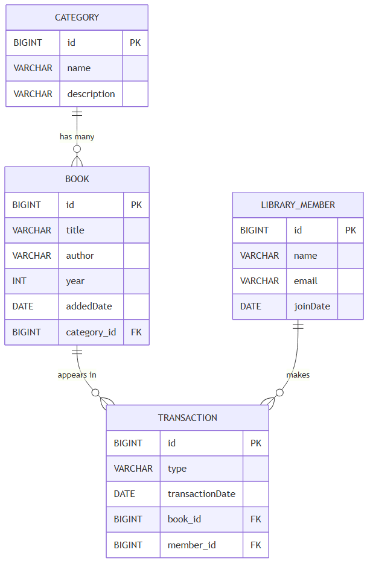
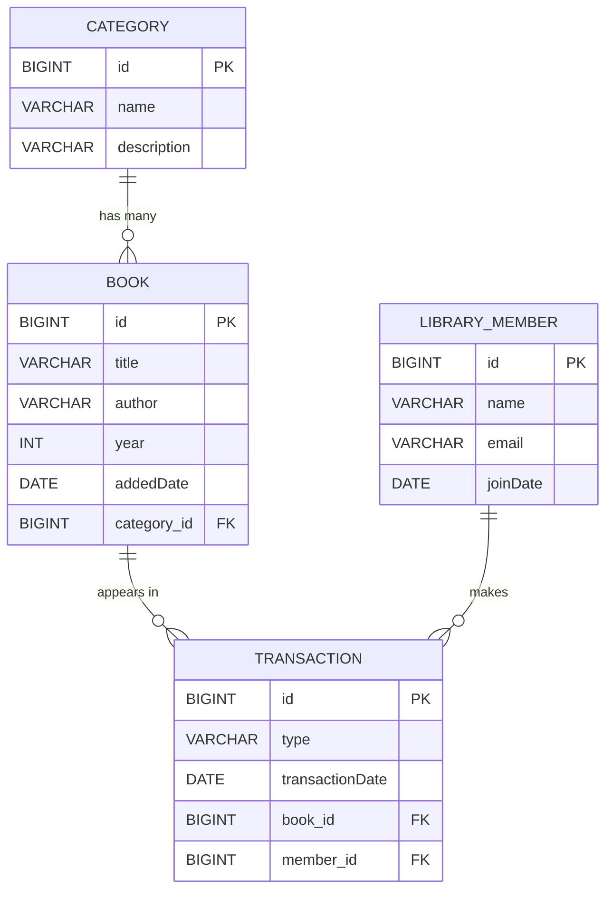

# Sample: JPA + MySQL (read this before the lab)

This is a worked example of everything you will be asked to do in the lab
[lab-web-data](https://github.com/camtdii/lab-web-data). The lab gives you classes
with `//TODO:` comments and empty annotations. Here, the same annotations are
already filled in, on the library from `library-design.md`.

Read this project first, run it, then go and do the lab.

The one difference: **the lab uses H2** (an in-memory database that needs no
install). **This sample uses MySQL**, so you also see what a real database
connection looks like. The JPA code is identical either way — only
`application.properties` changes.

---

## 1. Set up the database

You need MySQL running locally. Then create the user and the database once:

```sql
CREATE DATABASE spring_db;
CREATE USER 'spring_user'@'localhost' IDENTIFIED BY '1234abcd';
GRANT ALL PRIVILEGES ON spring_db.* TO 'spring_user'@'localhost';
FLUSH PRIVILEGES;
```

These are the settings already written in `src/main/resources/application.properties`.

## 2. Run it

```bash
mvn spring-boot:run
```

The tables are created and filled automatically on every startup, so the data
resets each time you restart. That is deliberate — the sample always starts from
a known state.

Every endpoint is behind the API key filter that was added in the previous
lesson, so **every request needs the header `apikey: 123456`**:

```bash
curl -H "apikey: 123456" http://localhost:8080/api/books
```

---

## 3. The data model

Read this the same way as the diagram in the lab:

- `PK` is the primary key, `FK` is the foreign key.
- The crow's foot `{` means **many**. The bar `||` means **exactly one**.
- **The table on the "many" side keeps the foreign key.**



The picture above is generated from the block below (source also in
`library-data-model.mmd`). GitHub and VS Code render it live, so edit the text
rather than the image:



One category has many books, so `book` holds `category_id`. One book has many
transactions and one member has many transactions, so `transaction` holds *both*
`book_id` and `member_id` — it is on the "many" side twice.

### The same picture in Java

This is the part that matters for the lab: which annotation goes where. The
arrow always points from the class that **holds the foreign key**.

There are three relationships. Each one is written twice — once on the class
that holds the column, and once on the class that does not.

```
(1)  one Category  ──<  many Books

     Category                                  Book
       @OneToMany(mappedBy = "category")         @ManyToOne
       List<Book> books                          Category category
       ...holds NO column                        ...holds column category_id


(2)  one Book  ──<  many Transactions

     Book                                      Transaction
       @OneToMany(mappedBy = "book")             @ManyToOne
       List<Transaction> transactions            Book book
       ...holds NO column                        ...holds column book_id


(3)  one Member  ──<  many Transactions

     Member                                    Transaction
       @OneToMany(mappedBy = "member")           @ManyToOne
       List<Transaction> transactions            Member member
       ...holds NO column                        ...holds column member_id
```

Notice that `Transaction` appears on the right in both (2) and (3): it is on the
"many" side twice, which is why it carries two foreign keys.

Three rules to take into the lab:

1. The **`@ManyToOne`** side owns the link and gets the FK column. A field named
   `category` becomes the column `category_id` — no `@JoinColumn` needed.
2. The **`@OneToMany`** side owns no column, so it must say **`mappedBy`**, and
   the name in `mappedBy` is the *field name on the other class* — `mappedBy =
   "category"` because `Book.category` is what holds the link.
3. A class can be on the "many" side of more than one relationship.
   `Transaction` has two `@ManyToOne` fields, exactly like `Seat` in the lab.

Compare with the lab and the shapes line up one for one:

| lab-web-data | this sample | the relationship |
| --- | --- | --- |
| `Performer` | `Category` | the "one" side, has `@OneToMany` |
| `Concert` | `Book` | `@ManyToOne` up, `@OneToMany` down |
| `Person` | `Member` | the "one" side, has `@OneToMany` |
| `Seat` | `Transaction` | two `@ManyToOne` fields, holds two FKs |

## 4. The four things the lab asks you to do

### (a) `@Entity`, `@Id`, `@GeneratedValue` — see `Book.java`, `Category.java`, `Member.java`, `Transaction.java`

```java
@Entity
public class Book {

    @Id
    @GeneratedValue(strategy = GenerationType.IDENTITY)
    private Long id;
```

`IDENTITY` is required because the tables use `AUTO_INCREMENT`: the **database**
makes the id, and Hibernate reads it back after the INSERT. That is why no code
anywhere assigns an id.

`Book` used to be a plain object kept in a `HashMap`. Adding these three
annotations is the entire change that turned it into a database row — compare it
with the old version in git history.

### (b) `@ManyToOne` and `@OneToMany(mappedBy = ...)` — see `Book.java` and `Category.java`

One category has many books. The **many** side holds the foreign key:

```java
// in Book  -> maps to the column category_id
@ManyToOne
private Category category;

// in Category -> no column of its own
@OneToMany(mappedBy = "category")
private List<Book> books;
```

`mappedBy = "category"` tells Hibernate *"the link is already stored by Book, in
its category field"*. Leave it out and Hibernate looks for a join table
`CATEGORY_BOOK` that does not exist, and startup fails. This is the mistake the
lab warns you about.

`Transaction` is the interesting one: it sits on the **many** side of *two*
relationships at once, so it holds two foreign keys.

```java
@ManyToOne private Book book;      // -> book_id
@ManyToOne private Member member;  // -> member_id
```

That is exactly the shape of `Seat` in the lab (one seat, one concert, one person).

### (c) The repository — see `BookRepository.java`

```java
public interface BookRepository extends CrudRepository<Book, Long> {

    List<Book> findByCategoryId(Long categoryId);
    Book findByTitle(String title);
}
```

Two type parameters: the entity class, and the type of its `@Id` field. That
alone gives you `findAll()`, `findById()`, `save()`, `delete()` and `count()`.

The two methods are **derived queries** — you write no body. Spring reads the
method *name* and generates the SQL:

| Method name | Generated WHERE clause |
| --- | --- |
| `findByTitle` | `WHERE title = ?` |
| `findByCategoryId` | `WHERE category_id = ?` |
| `findByAuthorContainingIgnoreCase` | `WHERE LOWER(author) LIKE '%?%'` |
| `findFirstByBookIdOrderByIdDesc` | `WHERE book_id = ? ORDER BY id DESC LIMIT 1` |

Note it is a `interface`, and you never write `new BookRepository()`. Spring
builds the object at startup, and `@Autowired` hands it to your controller.

### (d) The tables already exist — see `schema.sql` and `application.properties`

```properties
spring.jpa.hibernate.ddl-auto=none            # Hibernate must NOT create tables
spring.datasource.initialization-mode=always  # run schema.sql then data.sql
```

**Your annotations must match the tables, not the other way around.** This is the
same setup as the lab, and the same reason a wrong annotation shows up as
`Table not found` or `Column not found`.

One more line matters:

```properties
spring.jpa.hibernate.naming.physical-strategy=org.hibernate.boot.model.naming.PhysicalNamingStrategyStandardImpl
```

It means **a field uses a column with the same name**: field `addedDate` uses
column `addedDate`, *not* `added_date`. The column names in `schema.sql` were
chosen to match the Java fields, which is why this project needs no `@Column`
and no `@JoinColumn` anywhere.

The one exception is `Member`:

```java
@Entity
@Table(name = "library_member")
public class Member {
```

`MEMBER` is a reserved word in MySQL 8, so the table had to be given a different
name — and `@Table` is how you point an entity at it.

---

## 5. The endpoints

All paths start with `/api` and all need `-H "apikey: 123456"`.

| Method | Path | What it does |
| --- | --- | --- |
| GET | `/api/books` | list all books (add `?author=fowler` to filter) |
| GET | `/api/books/{id}` | one book |
| POST | `/api/books` | add a book |
| PUT | `/api/books/{id}` | change a book |
| DELETE | `/api/books/{id}` | remove a book |
| GET | `/api/categories` | list categories |
| GET | `/api/categories/{id}/books` | **all books under one category** |
| GET | `/api/members` | list members |
| GET | `/api/members/{id}` | **one member** |
| GET | `/api/members/{id}/transactions` | that member's borrowing history |
| POST | `/api/members/{id}/transactions` | **borrow / return** `{book:{id}, type}` |
| GET | `/api/transactions` | list all transactions |
| POST | `/api/transactions` | **borrow / return** `{book:{id}, member:{id}, type}` |

### Try it in Postman

Import `postman/library-api.postman_collection.json` (Postman → *Import* → drop
the file in). You get 25 ready-made requests in five folders.

- The API key is set **once**, on the collection's *Authorization* tab, so every
  request inherits it. Only *No API key* overrides it, to show the 403.
- `baseUrl` and `apikey` are collection variables — change them in one place.
- Folder **4. Borrow and return** is the demo: run it top to bottom and it tells
  one story (member 2 borrows book 3 → cannot borrow it twice → someone else
  cannot return it → member 2 returns it → see the history).
- Every request carries a description explaining which JPA feature it exercises,
  and a test, so *Run collection* gives you a green report.

### Or try it with curl

```bash
# all books
curl -H "apikey: 123456" http://localhost:8080/api/books

# books in the Databases category
curl -H "apikey: 123456" http://localhost:8080/api/categories/2/books

# member 1
curl -H "apikey: 123456" http://localhost:8080/api/members/1

# member 2 borrows book 3
curl -H "apikey: 123456" -H "Content-Type: application/json" \
     -d '{"book":{"id":3},"type":"borrow"}' \
     http://localhost:8080/api/members/2/transactions

# try to borrow it again -> 400 "Book 3 is already borrowed"
curl -H "apikey: 123456" -H "Content-Type: application/json" \
     -d '{"book":{"id":3},"member":{"id":1},"type":"borrow"}' \
     http://localhost:8080/api/transactions

# member 2 returns it
curl -H "apikey: 123456" -H "Content-Type: application/json" \
     -d '{"book":{"id":3},"member":{"id":2},"type":"return"}' \
     http://localhost:8080/api/transactions
```

Then look in MySQL and see the rows really changed:

```sql
USE spring_db;
SELECT * FROM transaction;
```

---

## 6. Two details worth understanding

**How a related object arrives in the body.** The entity holds a `Book` object,
not a book id, so the JSON names the book as a nested object carrying only its
id:

```json
{ "book": {"id": 3}, "member": {"id": 2}, "type": "borrow" }
```

Jackson turns that into a `Transaction` whose `book` is a **placeholder** — a
`Book` with an id and nothing else. It is not a row from the database, so the
controller loads the real one before saving:

```java
Optional<Book> book = bookRepository.findById(bookId);
transaction.setBook(book.get());     // swap placeholder for the real row
```

Skip that step and Hibernate sees a `Book` it does not recognise and refuses to
save. `BookController` does exactly the same thing with `{"category":{"id":1}}`.

**Why some fields have `@JsonIgnore`.** A book knows its category, and a category
knows its books. If both were written into the JSON, Jackson would follow the
loop forever. Marking the collection side `@JsonIgnore` breaks the cycle. This is
not a JPA rule — it is a JSON rule, and you meet it as soon as a relationship
points both ways.

---

## 7. Watch the SQL

`spring.jpa.show-sql=true` prints every statement Hibernate runs. Call
`GET /api/categories/2/books` and watch one `SELECT ... WHERE category_id=?`
appear in the console. That is the derived query you never wrote.

## 8. If something breaks

| Message | Cause |
| --- | --- |
| `Communications link failure` | MySQL is not running |
| `Access denied for user 'spring_user'` | the user or the grant from step 1 is missing |
| `Unknown database 'spring_db'` | you skipped `CREATE DATABASE spring_db` |
| `Not a managed type: class th.mfu.X` | the class is missing `@Entity` |
| `No identifier specified for entity` | the class is missing `@Id` |
| `Table 'CATEGORY_BOOK' doesn't exist` | an `@OneToMany` is missing `mappedBy` |
| `ids for this class must be manually assigned` | `@GeneratedValue` is missing or not `IDENTITY` |
| HTTP 403 on every call | you forgot the `apikey: 123456` header |
